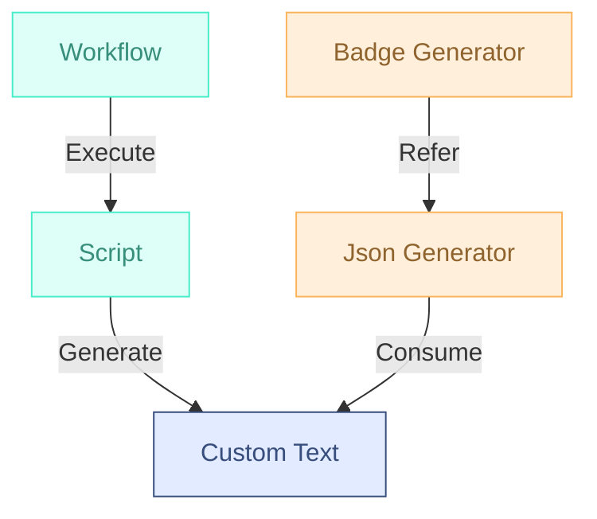

## 前言

头像来自 [Custom badge](https://img.shields.io/badge/Custom-Badge-blue) 。

### 什么是 Badge

在 GitHub 及开发相关环境中， badge （徽章）通常指的是一种在项目README文档或仓库主页上显示的小图标，用来展示项目的状态、质量、构建情况等信息。 badge 很常见，常见于开源项目的首页。

下图就是一个纯文本的 badge ：


#### 典型的 Badge 包括

- 构建状态（ Build Status ）：显示 CI/CD （如 GitHub Actions 、 Travis CI ）的构建是否通过。
- 覆盖率（ Coverage ）：代码测试覆盖率情况（如 Codecov 、 Coveralls）。
- 版本号（ Version ）：当前项目或包的最新版本（如 npm 、 PyPI）。
- 许可证（ License ）：显示当前项目采用的许可证类型。
- 依赖安全（ Dependencies ）：依赖包是否存在安全漏洞。

_以上内容来自 [Copilot](https://github.com/copilot/)_

#### Badge 生成器推荐

[Shields.io](https://shields.io/) 是一个 badge 生成网站，它支持多种 badge 的生成。

### 勘误

在深入研究文本之前，请务必注意可能存在一些 **语法错误** ，这可能是由于翻译错误、打字错误或作者独特的写作风格。

如果你有疑问或者建议，欢迎在评论区留言，或通过邮箱 shetty@shettydev.com 联系。

## 思路



- `Workflow`: 自定义的 workflow ，用于执行脚本。
- `Script`: 自定义的脚本，在 workflow 中被执行，用于生成自定义文本。
- `Custom Text`: 脚本生成的自定义文本，最终会在 badge 上展示。
- `Json Generator`: 根据文本生成 Json ，为 badge 生成提供参考，使用第三方 action [`Bring Your Own Badge`](https://github.com/marketplace/actions/bring-your-own-badge)。
- `Badge Generator`: 根据 Json 生成 Badge ，使用 action `Bring Your Own Badge` 提供的服务。


`Script` 部分是为了发挥编程语言优势，分担 workflow 工作，如果逻辑简单可以省略，在 `Workflow` 步骤中直接生成自定义文本。


## 示例配置与代码

以下内容以我的仓库 [kokuu-wakayuki/rustlings](https://github.com/kokuu-wakayuki/rustlings) 为例子。

### 仓库说明

这个仓库由 `rustlings` 命令生成，是 Rust 官方提供的 Rust 入门语法练习题若干。

使用 GitHub Action 在每次 push 时检测通过了几题，在 badge 中显示 `A/B` ，其中 `A` 表示通过的数量， `B` 表示总数量。

### Script

我使用了两个脚本，嵌套使用，发挥特定语言的优势。

#### Python Script

源文件： [`.github/script/rustlings_check.py`](https://github.com/kokuu-wakayuki/rustlings/blob/main/.github/scripts/rustlings_check.py) 。

代码逻辑如下，脚本不是本文的重点，本文不做赘述：

- 读取项目根目录的 [`Cargo.toml`](https://github.com/kokuu-wakayuki/rustlings/blob/main/Cargo.toml) 文件，获取题目。
- 使用 `rustlings run <test_name>` 的返回值判断是否通过。
- 统计通过的题目的数量，打印输出。

#### Makefile

源文件： [`.github/Makefile`](https://github.com/kokuu-wakayuki/rustlings/blob/main/.github/Makefile) 。

`ci_rustlings_check` 入口进行了依赖安装，简单包装了对上面 Python 脚本的调用。

### Workflow

源文件： [`.github/workflows/rustlings-check.yml`](https://github.com/kokuu-wakayuki/rustlings/blob/main/.github/workflows/rustlings-check.yml) 。

#### 执行脚本

将 `make ci_rustlings_check` 的输出储存至变量 GITHUB_OUTPUT 中。

```yaml
- id: test
    name: Run test script
    run: |
      cd .github/
      result=$(make ci_rustlings_check)
      echo "result=$result" | tee "$GITHUB_OUTPUT"
```

#### 生成 Json

从 GITHUB_TOKEN 取出刚刚存储的值，使用 action [kokuu-wakayuki/rustlings](https://github.com/kokuu-wakayuki/rustlings) 生成 Json 。

- `NAME`: 与 URL 相关。
- `LABEL`: Badge 左边的文字。
- `ICON`: 图标，参考 [Badgen](https://badgen.net/) 。
- `STATUS`: Badge 右边的文字。
- `COLOR`: 颜色。

```yaml
- name: Generate custom badge
  uses: RubbaBoy/BYOB@v1.3.0
  with:
    NAME: progress
    LABEL: 'Rustlings progress'
    ICON: 'terminal'
    STATUS: ${{ steps.test.outputs.result }}
    COLOR: blue
    GITHUB_TOKEN: ${{ secrets.GITHUB_TOKEN }}
```

### 使用 Badge

Action 成功后，当前仓库会生成一个新的分支 [shields](https://github.com/kokuu-wakayuki/rustlings/tree/shields) 。

其中包含了 [shields.json](https://github.com/kokuu-wakayuki/rustlings/blob/shields/shields.json) 。

使用 URL `https://byob.yarr.is/<username>/<repo_name>/<NAME>` 获取图片。

## 效果展示

[](https://github.com/kokuu-wakayuki/rustlings?tab=readme-ov-file#rustlings)
